# R22 PPT UI 逐页设计解析与现状差异审计

> Round: `R22_APPLE_STYLE_PRODUCT_UI_IMPLEMENTATION`
>
> Execution mode: `SUPERVISED`
>
> Gate: `Gate 0 — 设计解析`
>
> Status: `COMPLETE / WAITING_FOR_DESIGN_GATE_CONFIRMATION`
>
> 本文只记录设计理解、路由/API 映射和现状差异，不代表已经开始 UI 实现。

## 1. 设计源、完整性与解析方法

### 1.1 唯一视觉源

- PPT：`docs/design/轻卡定制色开发系统_Apple风产品UI设计稿.pptx`
- 主执行提示词：`docs/design/R22_APPLE_STYLE_PRODUCT_UI_IMPLEMENTATION_Codex_MASTER_PROMPT.md`
- 业务流程补充参考：`docs/design/定制颜色开发流程图.pdf`

PPT 归档文件与下载源 SHA-256 一致：

```text
9b58a59fc56d8cec4756a40dacc701cb610e3d3775ce2157764b9e3094d36b27
```

主执行提示词归档文件与下载源 SHA-256 一致：

```text
666150219899ebf9c274b8000aaedc2e227451a6221821098b4f5375baac3bba
```

### 1.2 渲染结果

- PPT 共 12 页。
- 已全部渲染为 `1920 × 1080` PNG。
- 页面尺寸为 `12192000 × 6858000 EMU`，即 16:9。
- `slides_test.py` 检查通过：未发现 PPT 内容溢出画布。
- 已逐页按原始分辨率目视检查，未发现裁切、空白页或渲染缺失。
- 总览图：`docs/design/r22-ppt-render/contact-sheet.png`
- 逐页图：`docs/design/r22-ppt-render/slide-01.png` 至 `slide-12.png`

### 1.3 PPT 元数据提取结论

- PPT 全部文字使用 `PingFang SC`。
- 生产 Web 不打包 Apple 字体文件，按主提示词使用系统字体栈：

```css
-apple-system, BlinkMacSystemFont, "SF Pro Display", "SF Pro Text",
"PingFang SC", "Microsoft YaHei", "Helvetica Neue", Arial, sans-serif
```

- PPT 主要色值提取结果与主提示词一致：
  - 一级文字：`#1D1D1F`
  - 二级文字：`#5E6470`
  - 页面背景：`#F5F5F7`
  - 卡片背景：`#FFFFFF`
  - 边框：`#E2E5E9`
  - 主品牌蓝：`#315F86`
  - 已完成：`#367A54`
  - 待评审：`#B27A21`
  - 已逾期：`#B94C4C`
  - 月度跟踪：`#2F7B79`
- PPT 视觉规律是“大标题 + 一层核心卡片 + 大面积留白”，不是密集企业后台表格。

### 1.4 注释与生产内容边界

以下文字是设计稿说明，不进入生产页面：

```text
PAGE DESIGN
DESIGN SYSTEM
INFORMATION ARCHITECTURE
KEY INTERACTION
ADMIN PAGE
NEXT
01｜员工工作台
02｜项目管理看板
03｜项目工作区
04｜进展提交面板
05｜我的任务
06｜进展材料上传
07｜项目生命周期复盘
08｜后台管理看板
```

生产页面需要还原的是信息层级、留白、卡片比例、字号、颜色、状态与交互路径。

## 2. 全局设计语言解析

### 2.1 信息密度

- 每页只回答一个核心问题。
- 默认只展示结论、当前状态、负责人、截止时间、风险和下一步。
- 完整历史、筛选项和节点细节通过展开、抽屉或项目上下文进入。
- 同一页面只有一个视觉最强的主动作。

### 2.2 字体层级

- 页面主标题：36–40px；PPT 设计规范以 40px 为基准。
- 模块标题：24–28px；PPT 以 28px 为基准。
- 卡片标题：18px。
- 正文：16px。
- 辅助说明：14px。
- 12px 只用于少量角标、时间和辅助标签。

### 2.3 空间与容器

- 页面最大宽度：1440px。
- 桌面横向留白：48px；平板 32px；手机 20px。
- 8px 基础间距体系；主要模块间距为 32/48/64px。
- 卡片圆角 20px，内边距 24–28px，边框轻、阴影弱。
- 页面不应由多层卡片嵌套形成“后台盒子墙”。

### 2.4 状态表达

- 颜色只用于强调，不整块铺满卡片。
- 状态必须同时有文字，不能只靠色彩。
- 红色只标记具体问题、逾期或缺失，不把整张项目卡染红。
- 未开始节点降低视觉权重；当前节点、已完成路径、下一步和风险节点优先。

### 2.5 响应式语义

- 1440px：完整还原 PPT 桌面结构。
- 1024px：项目工作区改为流程图在上、工序详情在下；卡片减少列数。
- 390px：工作台、任务、进展提交、材料上传优先；项目流程改为阶段式纵向时间线。

## 3. 逐页设计解析

## Slide 1 — 产品目标与封面

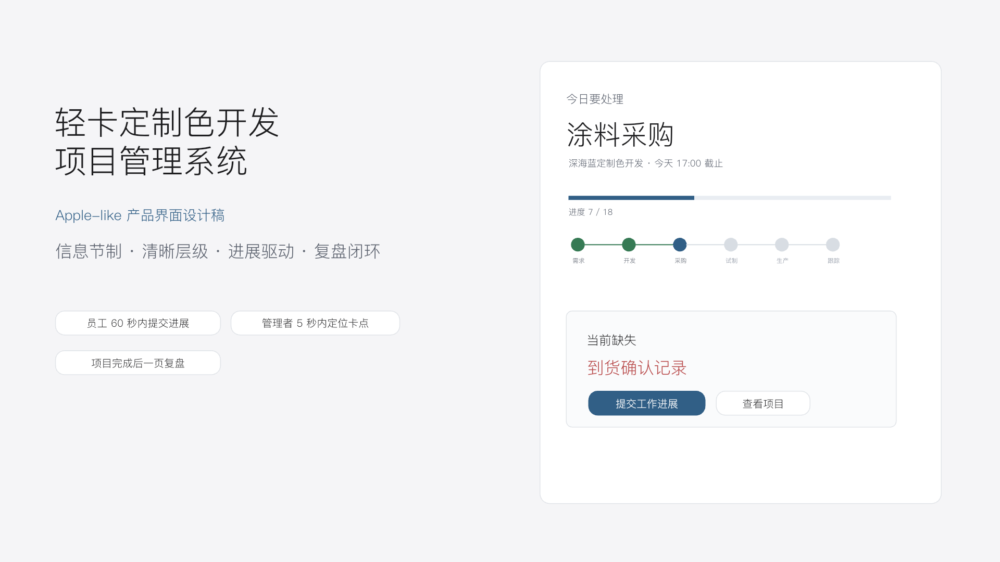

- 类型：产品目标，不作为生产路由。
- 页面核心问题：系统是否把“当前要做什么、缺什么、下一步是什么”变成首屏结论。
- 主标题与说明：轻卡定制色开发项目管理系统；Apple-like；信息节制、清晰层级、进展驱动、复盘闭环。
- 布局结构：左侧 60% 为大标题和三条产品目标，右侧 40% 为“今日要处理”示意卡。
- 主要卡片：当前任务、六阶段进度、当前缺失。
- 主动作：提交工作进展。
- 次级动作：查看项目。
- 字号和留白：超大标题、低密度、单一白色示意卡、大面积灰白背景。
- 对应系统路由：无；用于约束 `/dashboard` 和进展提交入口。
- API：无直接 API；概念卡数据最终来自个人工作台聚合接口。
- 真实数据：示意内容不能作为生产硬编码数据。
- 测试方式：作为产品总目标，最终用工作台 10 秒定位任务、60 秒提交进展的 Playwright 场景验证。

## Slide 2 — 设计系统与产品原则

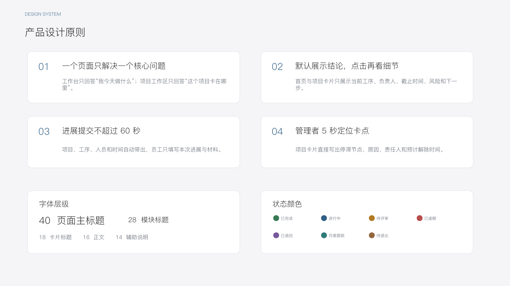

- 类型：设计规范，不作为生产路由。
- 页面核心问题：所有页面遵守哪一套信息密度、字号和状态语言。
- 主标题与说明：一个页面一个问题；默认结论；60 秒提交；5 秒定位卡点。
- 布局结构：四张原则卡 + 字体层级卡 + 状态颜色卡。
- 主要卡片：四条设计原则、字体标尺、七种状态色。
- 主动作：无。
- 次级动作：无。
- 字号和留白：40/28/18/16/14；2×2 原则卡；浅灰背景、白卡、细边框。
- 对应系统路由：转化为全局 token、基础组件和开发环境组件预览页。
- API：无。
- 真实数据：无。
- 测试方式：CSS token、组件测试、Chromatic/Playwright 截图和 390/1024/1440 排版检查。

## Slide 3 — 收敛后的信息架构

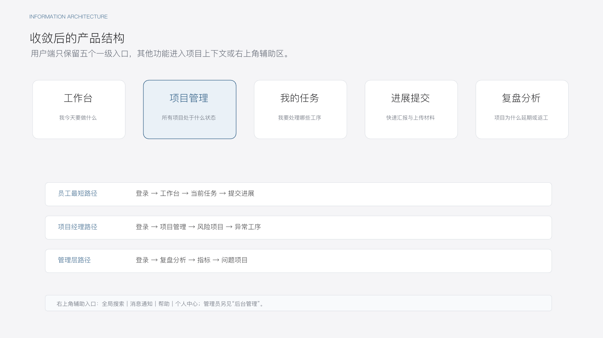

- 类型：信息架构，不作为单一生产页面。
- 页面核心问题：普通用户如何用最少一级入口完成工作。
- 主标题与说明：用户端只保留五个一级入口，其他功能进入项目上下文或右上角辅助区。
- 布局结构：五张同级入口卡 + 三条角色最短路径 + 辅助入口说明。
- 主要卡片：工作台、项目管理、我的任务、进展提交、复盘分析。
- 主动作：五个一级导航入口。
- 次级动作：全局搜索、消息通知、帮助、个人中心；管理员额外看到后台管理。
- 字号和留白：入口卡宽度一致，项目管理仅以淡蓝底强调示例；页面层级平坦。
- 对应系统路由：`/dashboard`、`/projects`、`/tasks`、`/progress`、`/retrospectives`。
- API：导航本身不需 API；管理员入口与用户身份由 session/权限决定。
- 真实数据：用户角色必须来自真实登录态。
- 测试方式：普通用户只看到五个一级入口；管理员额外看到后台管理；旧入口不再并列。

## Slide 4 — 员工工作台

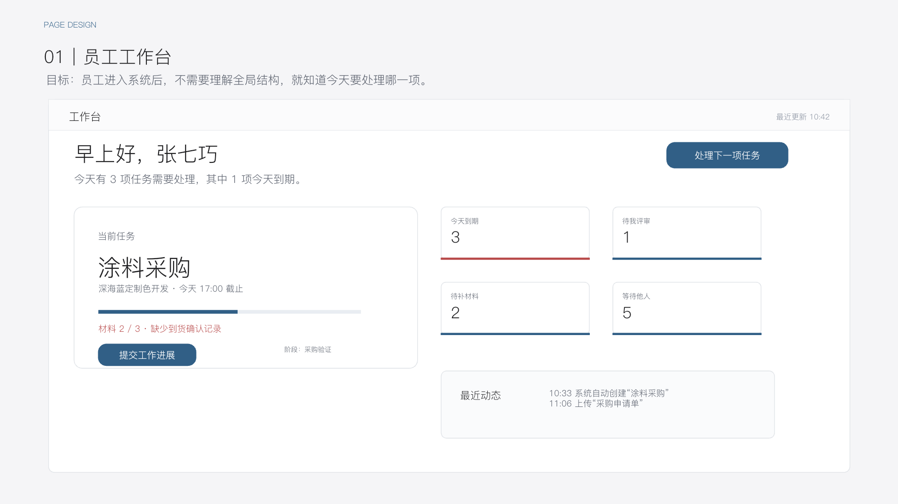

- 类型：生产页面。
- 页面核心问题：我今天应该做什么。
- 主标题与说明：大字号个性化问候 + 今日任务摘要。
- 布局结构：顶部问候与唯一主按钮；左侧大型当前任务卡；右侧 2×2 快速统计；下方最近动态。
- 主要卡片：当前任务 Hero、今天到期、待我评审、待补材料、等待他人、最近动态。
- 主动作：处理下一项任务；当前任务卡内为“提交工作进展”。
- 次级动作：四个统计卡进入任务筛选；动态进入对应项目/任务。
- 字号和留白：问候接近 40px；当前任务名称约 32px；业务正文按 16px；首屏只保留一张当前任务大卡。
- 对应系统路由：`/dashboard`。
- API：建议新增 `GET /api/dashboard/personal-overview`，一次返回用户问候、优先任务、四项统计和最近 5–8 条动态。
- 可复用 API：`GET /api/tasks/my`、`GET /api/workflows/tasks/:taskId/detail`、`GET /api/dashboard/overview`、活动日志查询。
- 真实数据：必须；无任务显示真实空态，不能回退到演示人名。
- 测试方式：登录态、加载骨架、无任务、401、403、网络失败、部分失败、10 秒定位当前任务、主按钮可打开进展提交。

## Slide 5 — 项目管理看板

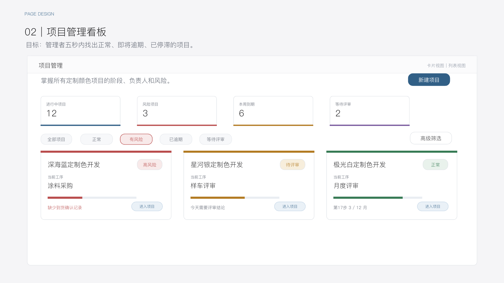

- 类型：生产页面。
- 页面核心问题：哪些项目正常、即将逾期或已停滞。
- 主标题与说明：项目管理；掌握所有项目阶段、负责人和风险。
- 布局结构：标题和唯一主按钮；四个指标；五个快速筛选；默认三列项目卡；高级筛选收起。
- 主要卡片：进行中、风险、本周到期、等待评审；风险/待评审/正常项目卡。
- 主动作：新建项目。
- 次级动作：进入项目；有权限用户催办；卡片/列表视图切换。
- 字号和留白：指标同级；项目卡有状态色顶部线，但主体保持白色；默认不展示密集表格。
- 对应系统路由：`/projects`。
- API：建议新增 `GET /api/projects/board`，返回四项指标、快速筛选计数、项目卡、停滞信息和分页。
- 可复用 API：`GET /api/projects`、`GET /api/dashboard/risk-projects`。
- 真实数据：必须；停滞原因、责任人和预计解除时间不能硬编码。
- 测试方式：四项指标、快速筛选、卡片默认视图、风险说明完整、列表视图正文不小于 15–16px、无权限催办不可见。

## Slide 6 — 项目工作区

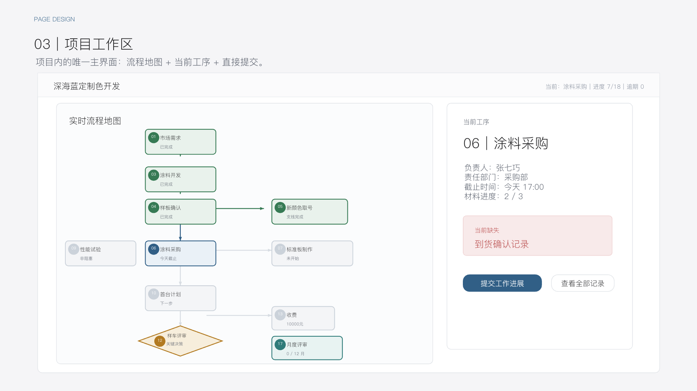

- 类型：生产页面。
- 页面核心问题：项目推进到哪里、卡在哪里、我现在能做什么。
- 主标题与说明：项目名称、当前工序、进度、风险和下一步。
- 布局结构：项目摘要；桌面端左 68–72% 流程地图，右 28–32% 持久化当前工序面板。
- 主要卡片：实时流程地图、当前工序详情、当前缺失。
- 主动作：根据权限和状态显示提交工作进展、开始评审或查看待补材料。
- 次级动作：查看全部记录；点击节点切换右栏。
- 字号和留白：地图不独占全页；右栏标题和缺失项权重高；未开始节点显著弱化。
- 对应系统路由：`/projects/:projectId`。
- API：建议新增 `GET /api/projects/:projectId/workspace`；聚合现有流程地图与当前任务详情，避免首屏多请求割裂。
- 可复用 API：`GET /api/projects/:projectId/flow-map`、`GET /api/workflows/tasks/:taskId/detail`。
- 真实数据：必须；18 节点拓扑、材料、负责人、评审/收费/月度/退出摘要均来自后端。
- 测试方式：70/30 布局、18 节点、点击节点切换右栏、特殊节点、动态主动作、1024 上下布局、390 纵向阶段时间线。

## Slide 7 — 进展提交面板

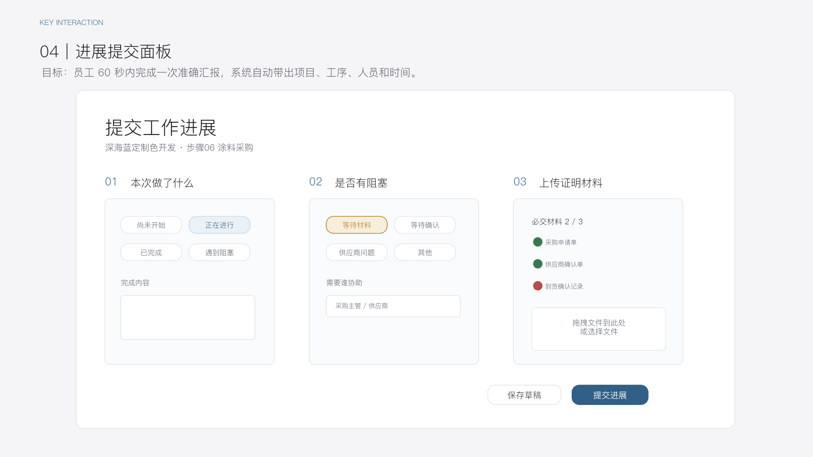

- 类型：关键生产交互。
- 页面核心问题：员工如何在 60 秒内准确汇报一次进展。
- 主标题与说明：系统自动带出项目、工序、人员和时间。
- 布局结构：三步并列/分步表单；底部固定操作栏。
- 主要卡片：本次做了什么、是否有阻塞、上传证明材料。
- 主动作：提交进展。
- 次级动作：保存草稿。
- 字号和留白：三步标题强、选项点击区大、必交材料状态清晰；不让员工重复选择项目/工序/本人/时间。
- 对应系统路由：`/progress?taskId=<taskId>`；从任务上下文打开时 URL 可恢复。
- API：需要新增 `POST /api/tasks/:taskId/progress`；建议为草稿使用同一资源的幂等 upsert 或明确 `PUT`；完成工序仍调用后端流转接口。
- 可复用 API：`PUT /api/workflows/tasks/:taskId/form`、`GET /api/workflows/tasks/:taskId/detail`、安全附件上传接口。
- 真实数据：必须；提交进展可多次，不能覆盖旧进展；完成工序需要后端权限、前置、材料和状态校验。
- 测试方式：URL 恢复、阻塞条件字段、草稿、重复进展、幂等提交、材料门禁、提交成功说明自动创建的下一步和下一项个人任务。

## Slide 8 — 我的任务

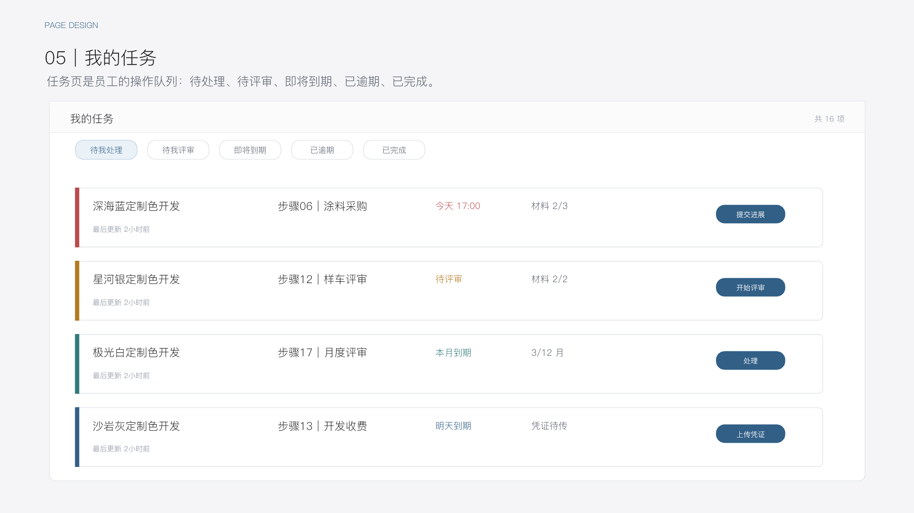

- 类型：生产页面。
- 页面核心问题：我有哪些工序需要处理。
- 主标题与说明：员工操作队列，按五种状态切换。
- 布局结构：顶部五个筛选；下方宽列表卡；每条一个类型化主动作。
- 主要卡片：任务宽卡，显示项目、步骤、截止、材料、最后更新和风险条。
- 主动作：根据任务类型为提交进展、开始评审、上传凭证、完成月度评审或确认退出结论。
- 次级动作：进入项目、查看记录。
- 字号和留白：避免默认密集表格；项目名和工序为主要信息，辅助信息一行展开。
- 对应系统路由：`/tasks`。
- API：扩展 `GET /api/tasks/my` 支持 `bucket=todo|review|upcoming|overdue|completed`，或提供等价聚合接口。
- 可复用 API：现有 `/api/tasks/my|pending|overdue`。
- 真实数据：必须；任务动作由后端返回或基于服务端任务类型字段映射，前端不能裁决流程。
- 测试方式：五种筛选、任务类型动作、材料数量、最后更新时间、空态/错误态、390px 单列可操作。

## Slide 9 — 进展材料上传

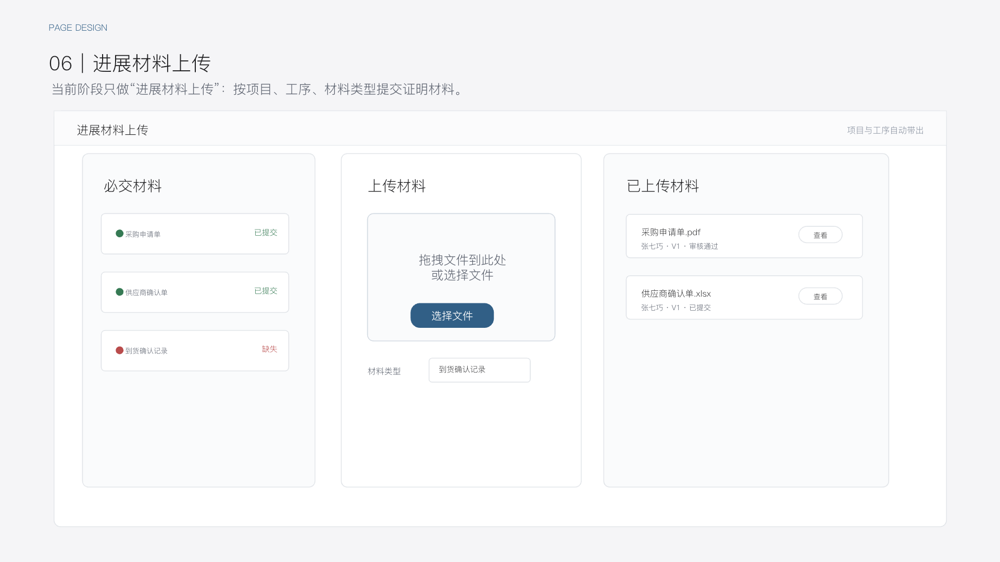

- 类型：生产页面。
- 页面核心问题：如何准确提交当前工序的证明材料。
- 主标题与说明：项目和工序由任务上下文自动带出。
- 布局结构：左侧必交材料清单；中间上传区；右侧/下方已上传材料列表。
- 主要卡片：必交材料、拖拽上传、已上传材料。
- 主动作：选择并上传当前缺失材料。
- 次级动作：查看、替换已有材料。
- 字号和留白：三栏逻辑清晰；缺失材料用局部红色；上传区域大且可拖拽。
- 对应系统路由：`/materials/upload?taskId=<taskId>&materialType=<type>`。
- API：复用附件上传，但需要任务/材料要求的服务端上下文与业务绑定；不得让用户任意改项目和工序。
- 真实数据：必须；文件名、类型、上传人、时间、版本和状态均来自后端。
- 测试方式：扩展名、MIME、魔数、大小、数量、路径穿越、权限、对象存储、元数据绑定、替换版本、查看/下载。

## Slide 10 — 项目生命周期复盘

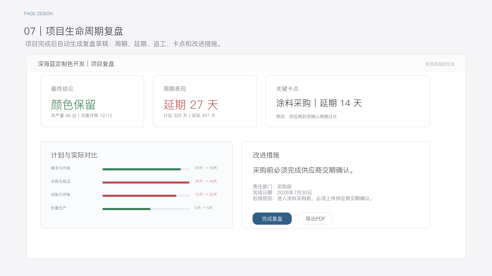

- 类型：生产页面。
- 页面核心问题：项目为什么提前、延期或返工，下一项目应如何改进。
- 主标题与说明：项目完成后自动生成复盘草稿。
- 布局结构：结论摘要；计划/实际；关键卡点；改进措施；经验沉淀。
- 主要卡片：最终结论、周期表现、关键卡点、阶段对比、改进措施。
- 主动作：完成复盘。
- 次级动作：导出 PDF。
- 字号和留白：结论数字大；问题、原因、措施三层分明；避免把复盘降级成普通备注。
- 对应系统路由：`/projects/:projectId/retrospective`；一级“复盘分析”建议使用 `/retrospectives` 作为完成项目索引。
- API：需要新增 `GET /api/projects/:projectId/retrospective`，以及保存草稿、完成复盘、导出 PDF 的写/导出接口。
- 可复用数据：项目计划/实际时间、流程任务、评审轮次、附件缺失、审计日志、月度评审、颜色退出。
- 真实数据：必须；自动生成是服务端计算结果，人工改进措施需持久化和审计。
- 测试方式：第 18 步完成后生成草稿、周期计算、返工次数、最大延期、材料缺失、保存/完成权限、PDF 导出。

## Slide 11 — 后台管理看板

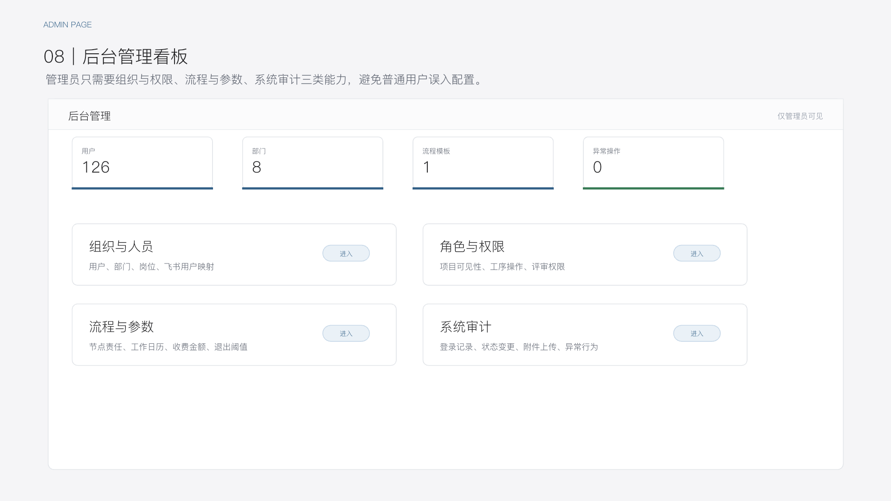

- 类型：管理员生产页面。
- 页面核心问题：管理员如何进入组织权限、流程参数和审计能力。
- 主标题与说明：仅管理员可见，普通用户不能看到入口和路由内容。
- 布局结构：四个摘要指标 + 2×2 管理模块卡。
- 主要卡片：组织与人员、角色与权限、流程与参数、系统审计。
- 主动作：进入四个模块。
- 次级动作：无。
- 字号和留白：四项摘要同级；模块卡只给结论和入口，不展开复杂配置表单。
- 对应系统路由：`/admin`；子模块可继续使用 `/admin/*`。
- API：建议新增 `GET /api/admin/overview`；子模块复用/补齐真实管理接口。
- 真实数据：必须；用户、部门、模板、异常操作来自数据库和审计记录。
- 测试方式：普通用户导航不可见、直接访问 403/无权限态、管理员可见、指标正确、四模块可进入。

## Slide 12 — 落地优先级与验收标准

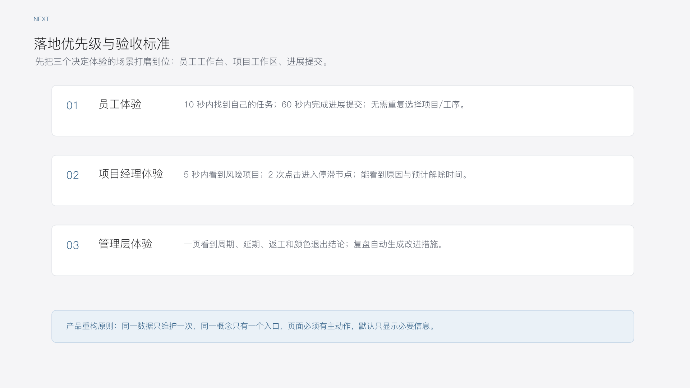

- 类型：验收标准，不作为生产路由。
- 页面核心问题：什么证据才能证明产品重构成功。
- 主标题与说明：先打磨员工工作台、项目工作区、进展提交三个决定体验的场景。
- 布局结构：员工、项目经理、管理层三条体验指标 + 底部产品重构原则。
- 主要卡片：员工体验、项目经理体验、管理层体验。
- 主动作：无。
- 次级动作：无。
- 字号和留白：三条验收卡纵向排列，结论优先。
- 对应系统路由：转化为 Playwright、视觉评分、响应式与发布门禁。
- API：无直接 API。
- 真实数据：最终验收必须使用 local/staging 合规 seed 或真实环境数据，生产不得用演示假数据。
- 测试方式：10 秒找任务、60 秒提交、5 秒识别风险、2 次点击进入异常工序、管理层一页复盘、每页视觉评分 ≥ 90。

## 4. 当前系统与设计稿总体差异

### 4.1 应用外壳与导航

当前实现：

- `AppShell` 同时渲染左侧常驻导航、顶部九个入口和项目上下文导航。
- 普通用户左侧存在系统导览、工作台、项目看板、流程地图、项目列表、新建项目、我的待办、逾期任务、材料中心、月度评审、数据中心、系统设置。
- 顶部又重复系统导览、工作台、项目管理、流程地图、工序管理、材料中心、月度评审、数据中心、系统设置。
- 项目内上下文还包含八个入口。

与 PPT 差异：

- 一级入口远多于五个，且左侧与顶部重复。
- 项目看板、流程地图、材料中心、月度评审、数据中心、系统设置仍是并列一级入口。
- “进展提交”和“复盘分析”两个 PPT 核心入口缺失。
- 全局搜索、帮助、个人中心未形成右上角辅助区。
- 390px 没有底部导航或真正折叠菜单；现有 1024px 断点只是把完整侧栏移到顶部。

结论：应用外壳需要结构性重构，不能只调整颜色。

### 4.2 全局视觉样式

当前实现：

- CSS 由早期样式和 R14/R21 后置覆盖叠加，存在两套 token 与多轮覆盖。
- 当前后置 token 使用 `#F6F8FA`、`#4F6F8F` 等近似色，但卡片统一被覆盖为 8px 圆角。
- 页面卡片最大宽度为 1240px，而目标为 1440px。
- `body` 字体为 `'PingFang SC', 'Helvetica Neue', sans-serif`，缺少完整系统字体回退。
- 代码中大量业务文字使用 11–13px；流程节点、表头、标签、动态和元数据尤为明显。
- 顶部与侧栏占据大量首屏空间，业务页面在 1440px 下仍显拥挤。

与 PPT 差异：

- 目标卡片圆角 20px、内边距 24–28px、正文 16px、主标题 36–40px。
- 当前页面依赖密集小字和多层卡片，不符合“默认展示结论”的信息节制。
- 当前局部仍有早期蓝绿渐变和多轮 CSS 覆盖，不是单一可审计设计系统。

结论：Gate 1 需要建立唯一 token 层和组件预览页，并逐步移除旧覆盖。

### 4.3 员工工作台 `/dashboard`

当前实现：

- 一次并行请求 8 个接口，任一接口失败会使整个首屏失败。
- 展示 7 个 KPI、最多 3 个完整项目时间线、月度评审、我的待办、阶段分布、逾期任务、最近评审、高风险项目。
- 页面首先回答“全局项目进度”，不是“我今天做什么”。
- 没有个性化大字号问候，没有唯一当前任务 Hero，没有“处理下一项任务”。

差异结论：需要重构，不保留当前首屏结构；可保留真实 API 类型、加载骨架、风险/动态数据处理方法。

### 4.4 项目管理 `/projects`

当前实现：

- 顶部直接铺开 9 个筛选字段。
- 默认展示十列表格，每行有 5 个文本操作链接。
- 没有四个 PPT 指标、五个快速筛选和默认项目卡视图。
- 项目 API 返回风险级别和是否逾期，但没有停滞原因、责任人、停滞天数和预计解除时间。

差异结论：页面和读模型都需重构；现有项目查询、分页、目录数据和创建入口可复用。

### 4.5 项目工作区 `/projects/:projectId`

当前实现：

- 根路由重定向到 `/overview`，首屏是项目编辑/概览，而不是推进工作区。
- 流程地图在 `/flow-map` 独立全宽展示，当前工序详情通过遮罩抽屉打开。
- 全图之后再展示长列表“最近动态”，不是 PPT 的 70/30 同屏决策结构。

差异结论：保留成熟的 18 节点拓扑、筛选、节点详情 API 和动作权限逻辑；重构路由和布局，把地图与当前工序面板合并为项目根页面。

### 4.6 进展提交

当前实现：

- 没有 `/progress` 或等价可恢复路由。
- 没有可多次追加的进展记录领域模型和接口。
- 现有 `PUT /workflows/tasks/:taskId/form` 只覆盖保存当前节点表单草稿。
- 现有流转接口可以开始/提交/完成节点，但不能替代“多次提交进展”。
- 没有阻塞类型、协助人、预计解除时间的持久化结构。

差异结论：这是 R22 的实质性 API/数据缺口，不能用前端状态或审计日志冒充业务记录。

### 4.7 我的任务

当前实现：

- 只有 `/tasks/my`、`/tasks/pending`、`/tasks/overdue`。
- 只返回当前用户活跃任务；不支持待我评审、即将到期、已完成五类统一筛选。
- 默认是八列表格，没有材料进度、最后更新时间、风险条和类型化主动作。

差异结论：保留任务查询权限和分页规则；扩展服务端读模型并改为宽列表卡。

### 4.8 材料上传

当前实现：

- `/materials` 是项目入口表；真正上传在 `/projects/:projectId/materials`。
- 用户需要选择归属类型和实体，未从任务上下文自动带出材料类型。
- 现有附件 API、安全校验、对象存储和元数据链路可复用。
- 页面截图中原生文件控件出现 `Choose File / No file chosen` 英文文案。
- `MaterialsCenter` 首次请求失败且没有 payload 时，会继续返回“正在加载材料提交平台”分支，错误不能落到明确失败态。

差异结论：保留后端上传安全链路和大部分附件管理能力；新增任务上下文上传页和材料要求绑定，修复错误态与英文控件。

### 4.9 生命周期复盘

当前实现：

- 没有 `/projects/:projectId/retrospective`。
- 没有项目复盘领域模型、改进措施、经验沉淀或完成复盘接口。
- `/analytics` 有全局聚合指标，但不能替代单项目复盘。

差异结论：需要新增路由、服务端聚合、持久化模型和迁移；可复用现有流程、评审、附件、审计、月度评审和颜色退出数据。

### 4.10 后台管理

当前实现：

- `/admin` 重定向 `/admin/users`。
- `/admin/users|roles|dicts|workflow-nodes` 全部是 `PagePlaceholder` 骨架。
- 导航会隐藏普通用户入口，但普通已登录用户直接访问占位路由时没有页面级角色守卫；后端数据接口尚未接入，因此当前没有真实后台内容但仍不符合路由权限门禁。

差异结论：需要真实 `/admin` 看板、后端管理员聚合接口、前端权限态和直接路由访问测试。

## 5. 数据与 API 缺口

| 需求 | 当前能力 | 缺口 | Gate 1+ 建议 |
|---|---|---|---|
| 个人工作台 | 8 个分散接口 | 易产生瀑布/全页失败，缺当前任务 Hero | 新增个人聚合接口，部分数据失败可降级 |
| 项目风险卡 | 项目列表仅有 riskLevel/isOverdue | 无停滞原因、停滞天数、预计解除时间 | 以最新未解决阻塞记录计算项目卡 |
| 项目工作区 | flow-map + task detail | 首屏需两次请求，数据源分散 | 新增 workspace 聚合接口或服务端组合 |
| 多次进展提交 | 无 | 无领域记录、无阻塞结构、无幂等写接口 | 新增进展记录与阻塞记录模型、migration、API、审计 |
| 任务五类筛选 | my/pending/overdue | 无 review/upcoming/completed，字段不足 | 扩展 `/tasks/my` 读模型与 bucket |
| 材料要求绑定 | node definition JSON + 附件实体 | 附件未直接绑定 workflow task/材料要求，版本/审核态不足 | 设计任务材料要求与附件绑定；保留对象存储 |
| 项目复盘 | 无 | 无自动草稿、改进措施、完成态和导出 | 新增复盘模型、聚合服务、migration 和 PDF 导出 |
| 后台概览 | 无 | 子页面为占位 | 新增 admin overview 和真实子模块接口 |

### 5.1 建议新增的领域记录

以下是 Gate 0 发现的数据缺口，不在本轮直接实施：

- `TaskProgressUpdate`：一次进展的状态、完成内容、下一步计划、提交人、提交时间、幂等键。
- `TaskBlocker`：阻塞类型、说明、协助人、预计解除时间、解除状态与解除时间。
- 任务材料要求与附件绑定：至少能明确某个 task 的某项必交材料由哪个附件满足，并保留版本/状态。
- `ProjectRetrospective` 与改进措施明细：自动计算摘要 + 人工编辑内容 + 完成状态 + 审计。

所有模型变更必须同时修改 `schema.prisma` 并生成 migration；Gate 0 不实施数据库变更。

## 6. 真实数据与生产风险

- 当前仓库页面均调用真实 API，没有用 PPT 截图做背景。
- 当前本地截图大量使用 `R20/UAT` 数据，这只能作为 local 测试 seed。
- R21C 台账记录生产曾受控执行 seed，生产目前存在 2 个演示项目并给飞书查看者授予观察权限。
- R22 生产验收前必须明确演示数据保留/清理策略；生产不得出现“演示采购专员”、旧 `8600` 收费或硬编码流程状态。
- 第 13 步固定 10000 元的后端规则和 R19/R19B 文件上传、OAuth state、CSP、权限、安全响应头修复必须保留。

## 7. Gate 0 验收结果

- [x] 12 张 PPT 图片已导出为 1920×1080 PNG。
- [x] 12 页已逐页全尺寸目视检查。
- [x] 已区分设计注释和生产内容。
- [x] 已逐页记录类型、核心问题、布局、卡片、动作、字号、路由、API、真实数据和测试方式。
- [x] 已建立 PPT 到路由的完整映射。
- [x] 已完成当前代码页面与 PPT 的差异清单。
- [x] 已识别需保留、重构、合并、隐藏的页面和组件（见 `PPT_SLIDE_ROUTE_MATRIX_R22.md`）。
- [x] 已记录 R19/R19B 安全修复保留要求和生产演示数据风险。
- [x] 本 Gate 未修改 `apps/web`、`apps/api`、Prisma schema 或业务规则代码。

## 8. 设计闸门结论

Gate 0 设计解析完成，执行到此停止。未获得用户明确确认前，不进入 Gate 1 设计系统和任何业务代码实现。
